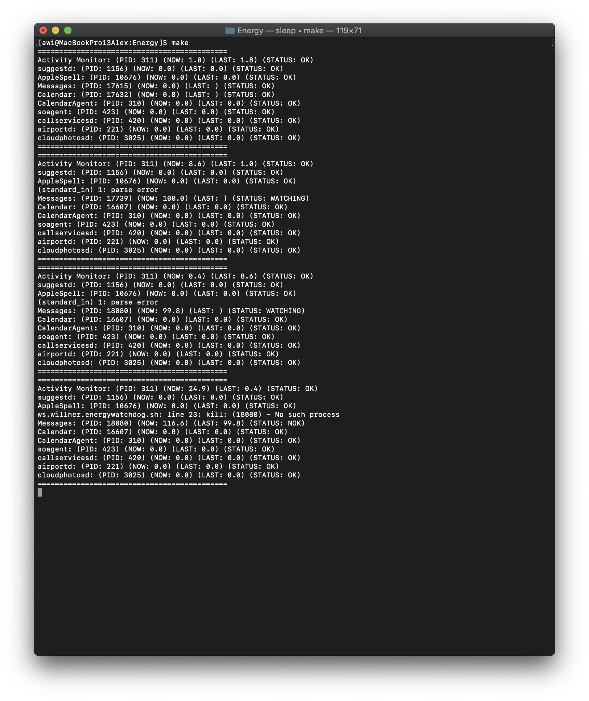

# macOS Energy Watchdog

## Summary

Sinple watchdog script that kills processes that consume a lot of energy.

## Description

When working mobile your MacBook should run as long as possible. However, sometimes tasks in the background drain the battery significantly. Often this is only recognized when a low energy warning pops up. This simple script runs in the background as a daemon and kills selected processes, in case they consume too much CPU time within a small time frame. This was inspired by 

## Usage

You should modify the header of the file ```ws.willner.energywatchdog.sh``` as needed before installing the daemon.

```
$ make run # to run
$ make install # to install
$ make remove # to remove
```

## Screenshot

Normally you're not seeing this script. However, here is the output when running manually. Here ```Messages.app``` gets killed.


