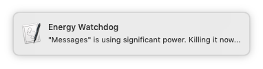
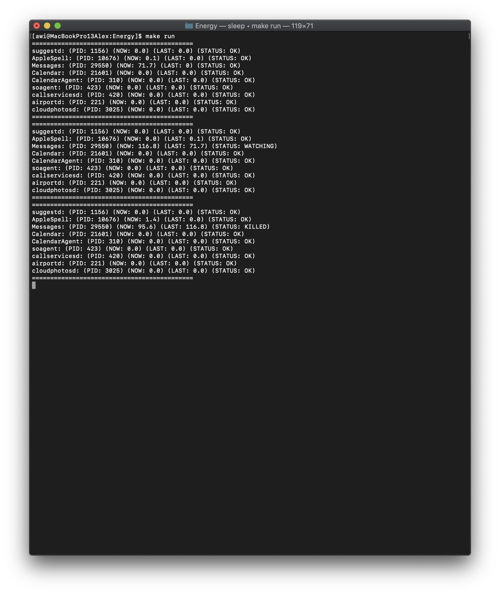

# macOS Energy Watchdog

## Summary

Simple macOS watchdog script that kills processes that consume a lot of energy.



## Description

When working mobile your MacBook should run as long as possible. However, sometimes tasks in the background drain the battery significantly. Often this is only recognized when a low energy warning pops up. This simple script runs in the background as an agent and kills selected processes, in case they are consuming too much of the CPU (e.g. ```> 80%```) within a small time frame (e.g. ```1 minute```).

## Usage

You should modify the header of the file ```ws.willner.energywatchdog.sh``` as needed before installing the agent. The ```make``` commands:

```
$ make
Nothing really to make, but there are some available commands:
 * run      : run application to test it
 * install  : install application as an agent
 * remove   : remove agent
 * feedback : create a GitHub issue
 * style    : style bash scripts
 * harden   : harden bash scripts
```

## Screenshots

The output when running the script manually. Here ```Messages.app``` gets killed.


